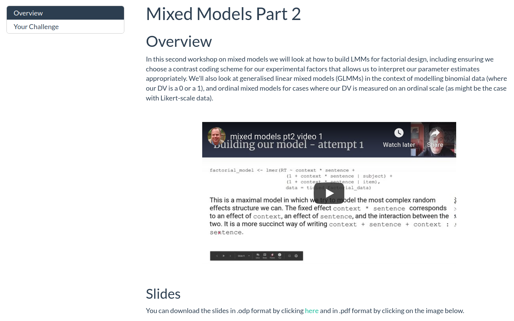
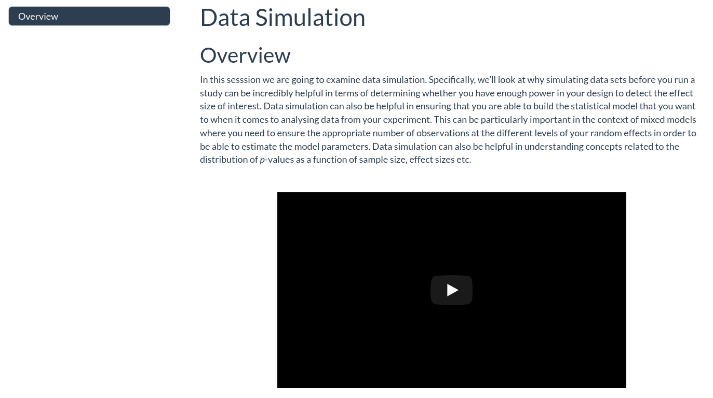

```{r setup, include=FALSE}
knitr::opts_chunk$set(echo = TRUE)
```

&nbsp;&nbsp;

Welcome to the Advanced Data Skills, Open Science and Reproducibility M.Res. unit BIOL63112. The following video (as with all the others in this unit) is best viewed in fullscreen mode at 1080 resolution. I have recorded the audio with a podcasting microphone, so it's best listened to with headphones. YouTube generates subtitles automatically, so please turn those in if you'd find them useful. 

As well as being able to contact me via [email](mailto:drandrewjstewart@gmail.com) you can also contact me via our dedicated Slack channel. The details on how to join our Slack channel can be found on Blackboard. You can install the Slack app on your computer or phone - I recommend you do this as interacting with Slack via the app is really great.

You can speak to me in one of the timetabled Zoom sessions (the details of those are on Blackboard) or via a personal meeting request - just ping me via email or Slack to request that. Additionally, you can follow me on [Twitter](https://twitter.com/ajstewart_lang?lang=en) where you'll see me tweet and re-tweet lots of Open Research and R content.

There are two assignments associated with this unit. The full details of these (plus hand in dates) can be found on the Blackboard page for this Unit.

&nbsp; &nbsp;  

# Mixed Models Part 1 (11/02)

In this first part we will see how mixed models combine aspects of linear regression and ANOVA while circumventing the need for observations to be independent of each other. We will also examine how we model the influence of random effects in our mixed models, and see how mixed models can cope with unbalanced designs and missing data.

<center>

&nbsp;  

[{width=75%}](https://ajstewartlang.github.io/15_mixed_models_pt1/knitted_workshop/15_mixed_models_pt1.html)

&nbsp;  

</center>

&nbsp;&nbsp;

# Mixed Models Part 2 (18/02)

In the second part we will examine mixed models for factorial designs, and explore how to model non-continuous dependent variables (e.g., binary and ordinal outcome variables) using the `glmer()` family of mixed models.

<center>

&nbsp;  

[{width=75%}](https://ajstewartlang.github.io/16_mixed_models_pt2/knitted_workshop/16_mixed_models_pt2.html)

&nbsp;  

</center>

&nbsp;&nbsp;

# Data Simulation (11/03)

In this session we will look at some R programming techniques that you can use to create simulated data sets. Data simulation is a really powerful tool as it allows you to determine whether you're likely to find an effect (for an assumed effect size) by simulating (for example) 10,000 experiments of a particular design with a particular sample size. It's also a great technique for determining whether your dataset will be sufficiently rich in order for you to build the kinds of models you need to in order to test a particular set of predictions. 

<center>

&nbsp;  

[{width=75%}](https://ajstewartlang.github.io/17_data_sim/knitted_workshop/17_data_sim.html)

&nbsp;  

</center>

&nbsp;&nbsp;

# Text Mining (18/03)

In this session we will cover the basics of text mining using R and examine how to count the occurrences of words in a text, engage in a basic sentiment analysis to examine what kinds of sentiments might be most common in a text. We'll also cover how to use measures such as term frequency-inverse document frequency as a way to understand what words (or phrases) are most uniquely associated with a text (compared to another set of texts).

<center>

&nbsp;  

[{width=75%}](https://ajstewartlang.github.io/27_introduction_to_text_mining/knitted_workshop/27_introduction_to_text_mining.html)

&nbsp;  

</center>

&nbsp;&nbsp;

# Hackathon (25/03 and 22/04)

This will be a fully Zoom-based activity so come along to the timetabled Zoom sessions to find out more...

&nbsp;&nbsp;

## Technical Details
All of the material in this workshop was created using open source where possible using an [Entroware Apollo laptop](https://www.entroware.com/store/) running [GNU/Linux distro Ubuntu 20.04 LTS (Focal Fossa)](https://releases.ubuntu.com/20.04/). The audio was captured with a [Fifine USB Podcasting microphone](https://www.amazon.co.uk/Condenser-Microphone-Recording-Interface-Power-K669/dp/B01N034RTC/ref=sr_1_1_sspa?crid=141Z8ED4VGCVD&dchild=1&keywords=fifine+usb+podcast+condenser+microphone&qid=1594989611&sprefix=fifne+usb%2Caps%2C162&sr=8-1-spons&psc=1&spLa=ZW5jcnlwdGVkUXVhbGlmaWVyPUFFMzAxOE5DUDJIREwmZW5jcnlwdGVkSWQ9QTA4MzA2NjIxVU40MlhNMFNCTDhWJmVuY3J5cHRlZEFkSWQ9QTA5NDI2OTQxOFY0R002UVJBS1AzJndpZGdldE5hbWU9c3BfYXRmJmFjdGlvbj1jbGlja1JlZGlyZWN0JmRvTm90TG9nQ2xpY2s9dHJ1ZQ==) and the video with a [Razer Kiyo webcam](https://www.amazon.co.uk/Razer-Streaming-Adjustable-Brightness-Microphone/dp/B076QK6489/ref=sr_1_3?dchild=1&keywords=razer+kiyo&qid=1594989677&sr=8-3). The audio and video were recorded using [Open Broadcast Software](https://obsproject.com/) and edited using [Shotcut](https://shotcut.org/). The R code was written using [R 3.6.3](https://www.r-project.org/), and run in the [RStudio Desktop IDE](https://rstudio.com/products/rstudio/download/) version 1.3.959. Ubuntu 20.04 LTS (Focal Fossa), OBS, Shotcut, R, and RStudio Desktop are all [open source](https://en.wikipedia.org/wiki/Open-source_software). 

The structure for this unit was very much inspired by the [Sharing At Short Notice](https://rstudio.com/resources/webinars/sharing-on-short-notice-how-to-get-your-materials-online-with-r-markdown/) webinar by Alison Hill and Desirée De Leon.

The repo for each workshop can be accessed via the 'Improve this Workshop' link at the bottom of each workshop page. The workshops and this website were all written using [R Markdown](https://rmarkdown.rstudio.com/) and the website is hosted on [Netlify](https://www.netlify.com/) via continunous deployment from [this GitHub repository](https://github.com/ajstewartlang/MRes_BIOL63101).

The source code for each of the Workshops above is licensed under the [MIT license](https://opensource.org/licenses/MIT), and the lecture content under [CC-BY](https://creativecommons.org/licenses/by/4.0/). 